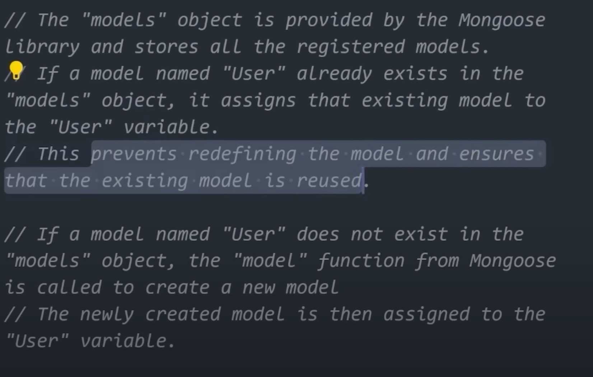
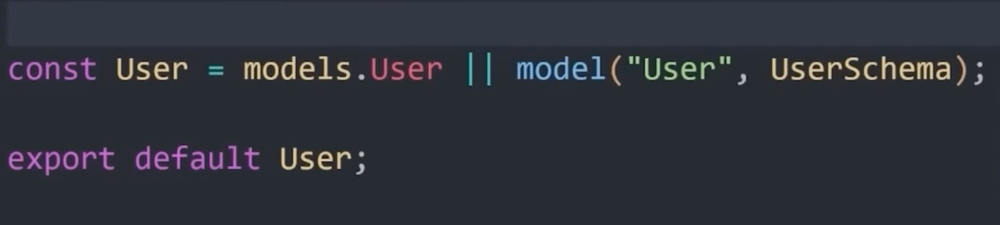

# Next.js 13 Fundamentals

> [part 1]

## Next.js advantages

1.  Simplifies the app dev process
1.  Automatically optimizes the web app through :

    - Rendering :

      - CSR ( Client Side Rendering : Same as CrateReactApp client )
      - SSR ( Dynamic Server Rendered Data (default ): First the component is generated on the server ,then sent to the client for rendering [Good For S.E.O {Easy Crawling and Indexing by web crawlers }] . With each request to the server , a new page is generated by the server and rendered , ensuring that the content is always up to date )  
        
      - SSG
        [ The only difference between SSG and SSR in terms of syntax is removing the `{cache:'no-store'}` statement , which means , you cache the page and make it static after the first page load ] ( Good for blog posts etc..)
        
      - ISG ( It re-generates a static site template after specified amount of time , so any changes to the data in that time is reflect . )
        [ The syntactical difference b/w this and the previous 2 is that you define a re-validation time , after which the page will be rebuilt on the server and served as a static page ]
        

    - Creating a new page:

      - Next.js has it's own file based routing system , each folder in the api folder becomes a route , and the folder name , the route path( so you're not dependent on some package like React Router Dom ).
      - Eg. For creating a new page named `new-page` , jest crate a `new-page folder` and crate a file named `page.jsx` which will have the content to be displayed when we visit `http://localhost:3000/new-page`

      - `Dynamic Page Routing` - If you want to create a dynamic page using the `:pageId` , for example , then you can do that using the`[postId]` folder (A folder , with the argument name within square brackets) within the `posts` folder .
      - Sharing UI components b/w components of a folder can be achieved by creating a `layout.js` file in the folder and putting common components the same way you put in the main folders layout page
      - You can create a `loading.js` file and an `error.js` ( will have `use client` at the top, as Error components must be client components) file in the Posts folder to handle any loading or error states when posts load or error out.

    - Routing :

      - The `Api` folder , has the `route-name/route.js` file which defines serverless api requests.

      - The serverless api architecture of next js frees us from worrying about managing the server infrastructure or scaling the server on increased demand ( as the serverless functions scale up and down as per demand automatically )
      - You define the the api routes in the `app/api` folder , where you name a folder corresponding to the route you want eg . `users` , and then define a `route.js` file , in which you define the serverless routes
        
        ( you'll get the data at `http://localhost:3000/api/users`)

    - Automatic Code Splitting :

      - Code splitting is a technique of splitting large bundles of javascript code to small , more manageable bundles that are loaded in as and when needed .

      - Code splitting leads to quicker load times of an app , thereby optimizing the user experience

      - In create react app , you need to manually do the code splitting process

---

Setup :

- The `layout` file within the `app` directory is the entry point into the app.

- Any component you render in the `layout` page will be reflected on every page of the app.

- The `page` represents the home page of the application. ( The page that's displayed when the app starts)

- By default , all components in the `app` folder are server components.

- If you want to make a page interactive ( i.e using react hooks , or onClick() , onChange() etc... .i.e Client Side Rendered ) , then render it as client component by adding `use client` statement at the top of the component page.

---

### Metadata / SEO

If you want to change the metadata , you could do it statically / dynamically by :

In this case , we statically render the `title` in the `head` tag


---

In this case , we dynamically render the `title` in the `head` tag


---

### CSS

- The `globals.css` file contains the global css properties of the entire app. This even has the `tailwind` imports to apply tailwind properties to our app.
-

> [End of part 1]

---

> [ Part 2 ]

# The `styles` folder :

This is the folder , with the `globals.css` file , where we define all our styles and we import it to use them in out project by importing it to our layout.jxs file at the top ` import '@styles/globals.css'` ( and change the `jsconfig.json` to)

```json
{
  "compilerOptions": {
    "paths": {
      "@*": ["./*"] // change @/* to @*
    }
  }
}
```

The main `layout.js` page will look like the following :

```javascript
import '@styles/globals.css';

export const metadata = {
  title: 'Next Demo',
  description: 'Learning the basics of Next.js',
};

const RootLayout = ({ children }) => {
  return (
    <html lang="en">
      <body>
        <div className="main">
          <div className="gradient" />
        </div>
        <main className="app">{children}</main>
      </body>
    </html>
  );
};

export default RootLayout;
```

---

### The Components Folder

This folder will have all the component files (`jsx files`) you'll use throughout the project .

You can import the components into files using `@component/ComponentName` into files .

- We need to call the NavBar component within the` layout.jsx` file in the app directory , so that it's visible on all pages throughout the app
- > [End of Part 2]

---

> [Part 3]

The `Nav` component is put right on top of the `{children}` in the `layout.jsx` file , as the nav component will be shared among all components in the app.


#### Creating the navigation bar component with `next-auth Google OAuth`

[Source Code for Nav](./components/Nav.jsx 'nav component')

The `Nav` component will be a client component , as we will be using `state hooks` for `auth`

##### Steps For Next/OAuth :

> [Source Code for Nav](./components/Nav.jsx 'nav component')

[ Log out Flow ]:

1. Mock the users being already logged in by defining a useState property `isUserLoggedIn` and set it's state to `true`

1. Create a similar fragment for when the user is not logged in with a sign-out button , which has and `onClick = {signOut}`, where the `signOut` function comes from `next-auth/react`

1. In the fragment that holds the signout button , use a next `Link` component , for the the profile , containing a Next `Image` component, which would conditionally render logged in persons pic/name . ( for the time being , you could use a dummy pic for the profile pic , till it's actually downloaded later)

---

[ Log in Flow ]:

1. We have to use the Next.js `getProviders` component from Next for an OAuth signup.
1. Create a state for `providers` : `const [providers,setProviders]=useState(null)`
1. Next, create a `useEffect` hook that runs during the initial component render and sets the provider using an async call to `setProviders`
1. Next, Check if you have `providers` set as as `not null` and conditionally render , the providers that are available to us by using the following code :

   ```javascript
   {
     providers && Object;
     values(providers).map((provider) => (
       <button
         type="button"
         key={provider.name}
         onClick={() => signIn(provider.id)}
         className="black_btn"
       >
         SignIn
       </button>
     ));
   }
   ```

1. You need to create the `Provider.js` component , inside which you import the `session` from the browser and render the children within it. it uses the session from the client ,thus we have to declare it as a `client component`

   > [Provider Code](./components/Provider.jsx 'provider')

1. Next , we import the provider to the `layout.js` file , so as to make it available to all components within the app

   > [Layout](./app/layout.jsx 'layout')

> [ End of Part 3 ]

---

> [ Part 4]

1. next , we need to create a route for the auth with the following folder structure

   

1. In the `route.js` file , we use the `GoogleProvider` from `next/auth` and use it to authenticate
   > [route.js code](./app/api/auth/%5B...nextauth%5D/route.js)
1. We need to create our Google SignIn Credentials from [Click to Visit Google Cloud Website](console.cloud.google.com)

   - First , Create a new project by going to the top left project name 
   - Next , Goto `Api's and Services` and then to ` OAuth concent screen` and click `Create`
   - Give the app a `name` and provide the `email` and , and we finally set everything up.

1. Next ,we go to the `credentials` tab and click `create credentials` , where we choose to create a `web app` with `http://localhost:3000` as `origin` and `redirect` , which will finally give us the prompt `oauth client created`
1. Next, we put the `client_id` an `client_secret` in our `.env` file and use it in our `auth` file using `process.env`

> [ End Part 4]

---

> [ Part 5 ]

#### MongoDb Setup :

1. First you need to create a mongoose model for the user

   > [Click to see : User Model Code ](./models/user.js)

   >  > 

1. Next, create a `database.js` file in the `utils folder` where you connect to the = MongoDb instance.

   > [database.js source code](./utils/database.js)

1. Next, we need to set 3 `.env` variables for Oauth to work with `next-auth`.

   - NEXTAUTH_URL = http://localhost:3000
   - NEXTAUTH_URL_INTERNAL = http://localhost:3000
   - NEXTAUTH_SECRET=ladWqU6y/mlG4kIWE+Y4shGZqL40EV8TLUtm6e6F370=

   - > Paste the following in the terminal and execute , to get the nextauth_secret :  
     > `openssl rand -base64 32`

1. Next, goto the `Nav` component and substitute `isUserLoggedIn` for `session?.user`
1. Goto all `Image` tags where the profile pic is supposed to be shown and replace it with `session.user?.image`
   ```javascript
   <Link href="/profile">
     <Image
       src={session?.user.image}
       //extract image from the session
       width={37}
       height={37}
       className="rounded-full"
       alt="profile"
     />
   </Link>
   ```
1. Copy the `next.js.config` (from this project) settings so as to ensure that the profile pic is loaded successfully
1. Now, when you `signUp` , your user data is saved to `MongoDb`

---

> [ End of Part 5 ]

---

> [ Part 6 ]

##### Creating Posts :

> To copy text to the clipboard , you can use the following as is : `navigator.clipboard.writeText(textToSaveToClipboard)`

1.  Create a new route for creating a new post :
1.  [ Api for creating new prompt ](`./app/api/prompt/new/`)
